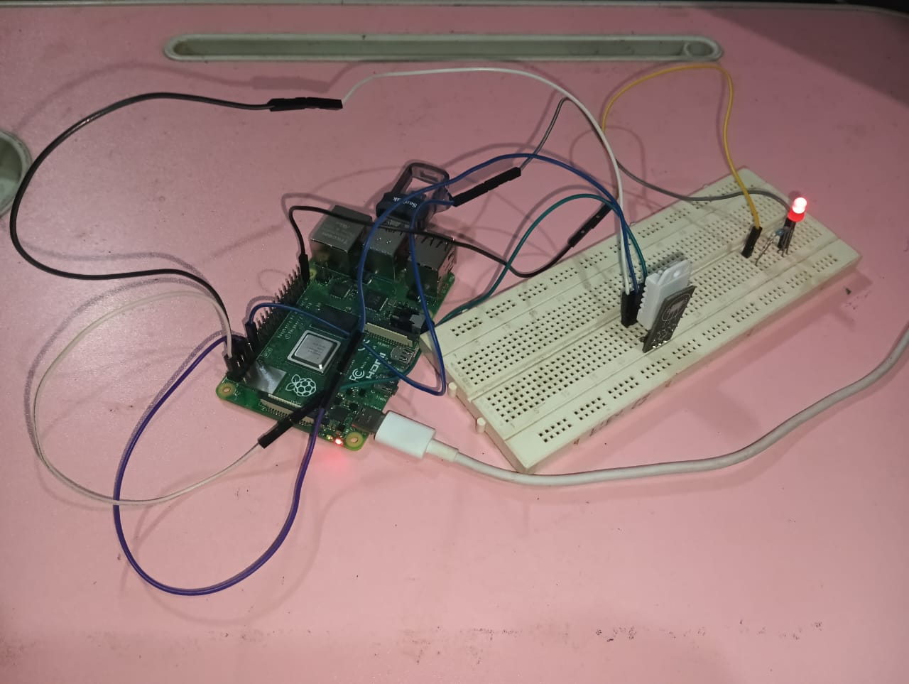
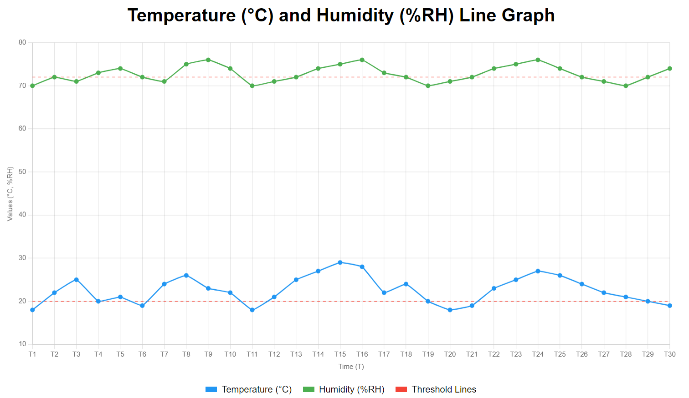

# IBlink: Software for IoT Interoperability using fog computing

This project is a **Temperature and Humidity Monitoring System** designed to collect real-time environmental data using a DHT22 sensor connected to a Raspberry Pi. It visualizes the data on an interactive graph and triggers a notification (via an LED) when the temperature exceeds a predefined threshold.

---

## Features
1. **Data Collection**: 
   - Real-time temperature (°C) and humidity (%RH) readings from the DHT22 sensor.
2. **Threshold Notification**: 
   - An LED blinks when the temperature exceeds **20°C**.
3. **Graph Visualization**: 
   - Displays temperature and humidity trends over time.
   - Includes threshold lines for better visual clarity.
4. **Custom UI**:
   - A professional and interactive graph created using HTML, CSS, and Chart.js.

---

## Hardware Setup

### Components:
1. **Raspberry Pi** (any model with GPIO support)
2. **DHT22 Temperature and Humidity Sensor**
3. **LED** and **Resistor** (330Ω recommended)
4. Jumper wires and a breadboard

### Connections:
| Component        | Raspberry Pi Pin |
|-------------------|------------------|
| **DHT22 Signal** | GPIO4 (Pin 7)    |
| **LED Positive** | GPIO17 (Pin 11)  |
| **LED Negative** | Ground (GND)     |
| **DHT22 VCC**    | 3.3V (Pin 1)     |
| **DHT22 GND**    | Ground (Pin 6)   |

---

### Raspberry Pi Output

---

### Graph Visualization UI
The graph includes:
1. **Temperature (°C)** and **Humidity (%RH)** trends.
2. Threshold lines for both metrics.

---

## Phase-1 Implementation Results
- **Graphs**: Real-time visualization of temperature and humidity trends.  
- **LED Notifications**: Alerts via blinking LED when the temperature exceeds the threshold.  
- **Real-Time Data Processing**: Reduced latency by leveraging fog computing near data sources.  
- **Comparison of Libraries**:  
  1. Implemented the project using **Adafruit DHT library** for simplicity and reliability.  
  2. Created an alternative solution **without external libraries** using custom GPIO-based DHT22 data handling for better understanding of low-level data processing.  
- **Accuracy**: Observed improved accuracy and ease of use with Adafruit libraries compared to manual GPIO-based implementations.  
- **Performance Analysis**: Compared the response time and error rates of both implementations under similar conditions. The library-based approach had fewer errors and faster data retrieval.  
- **Scalability**: Tested with multiple sensors connected to the same system, demonstrating stable performance.  

## Future Enhancements
- **Seamless Interoperability**: Bridge communication gaps between heterogeneous IoT devices (e.g., MQTT, CoAP, Zigbee).  
- **Database Integration**: Store sensor readings for long-term analysis and insights.  
- **Web Dashboard**: Enable users to view real-time data through an online interface.  
- **Mobile Notifications**: Push alerts to mobile devices when thresholds are exceeded.  
- **Blockchain Security**: Enhance trust and data integrity with blockchain-based transactions.  
- **Extended Standards Support**: Integrate support for emerging platforms like Matter and LoRaWAN.  
- **Cloud-Fog Collaboration**: Efficiently divide tasks between fog nodes and cloud systems for large-scale analytics.  
- **Energy Efficiency**: Develop low-power fog nodes powered by renewable energy sources.  
- **Enhanced Security**: Process sensitive data locally to ensure privacy and secure encrypted transmission.   